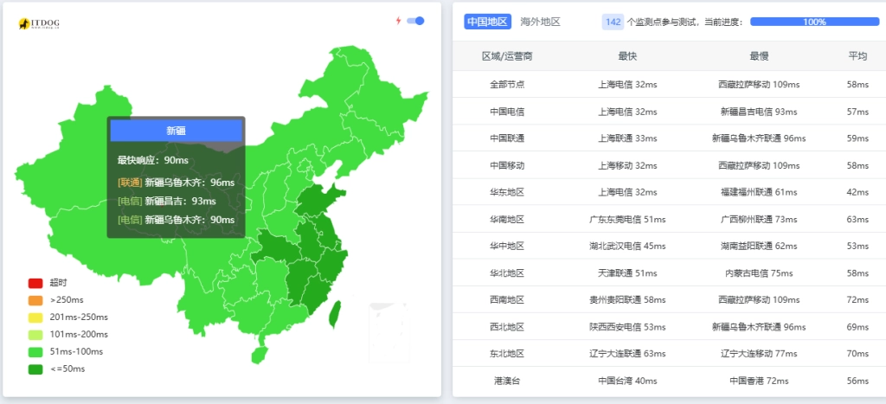
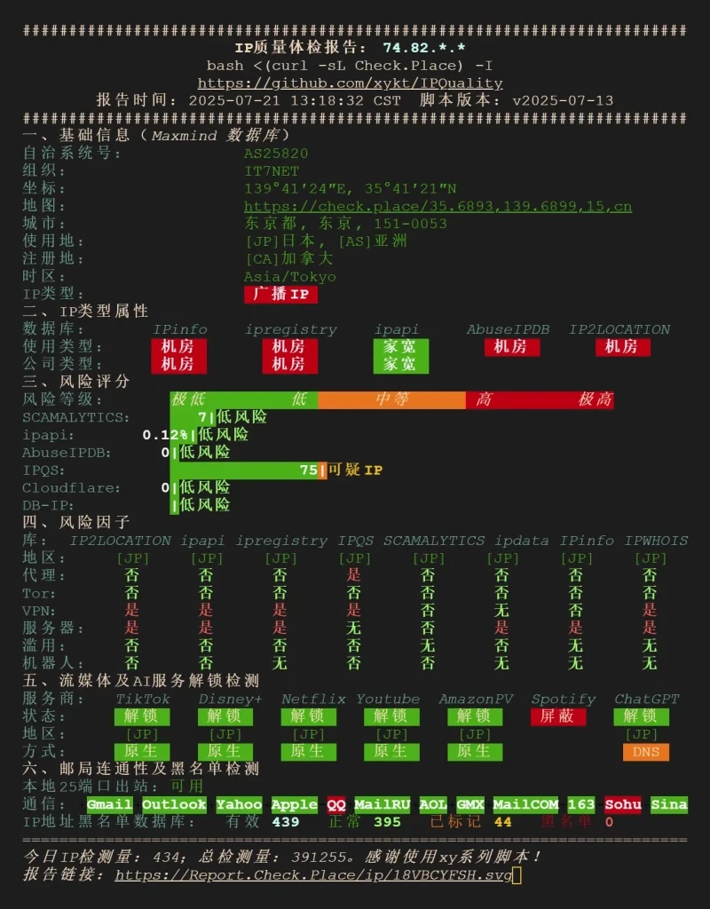
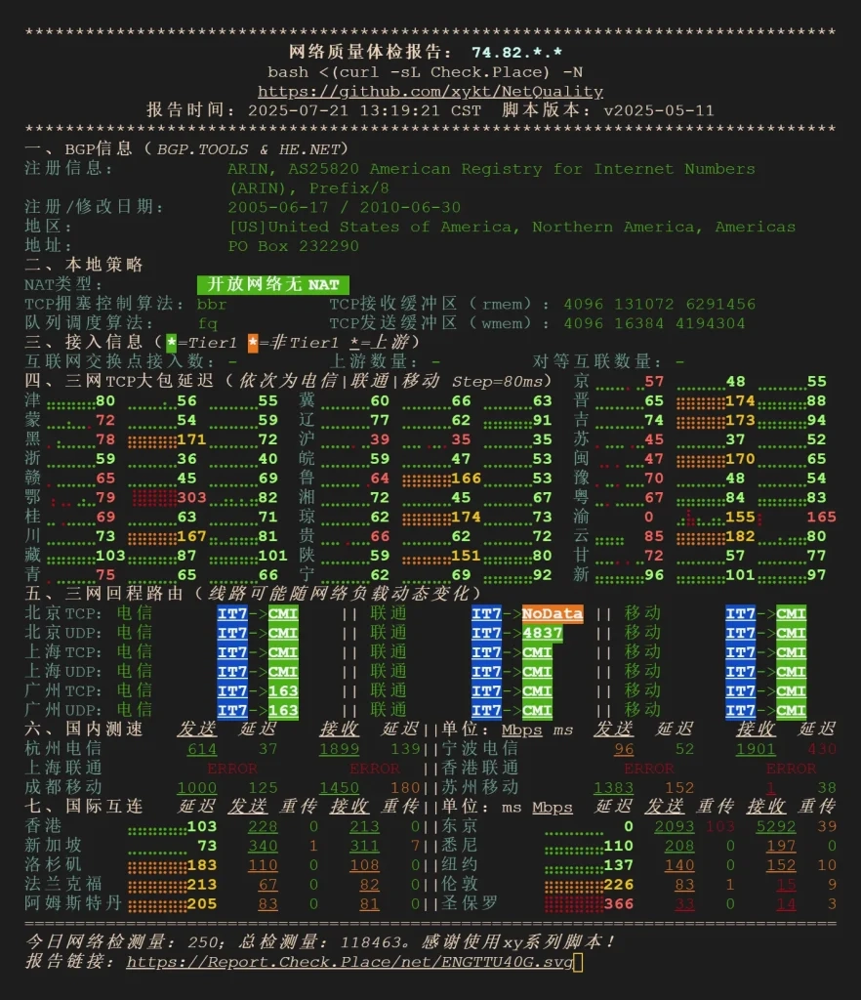
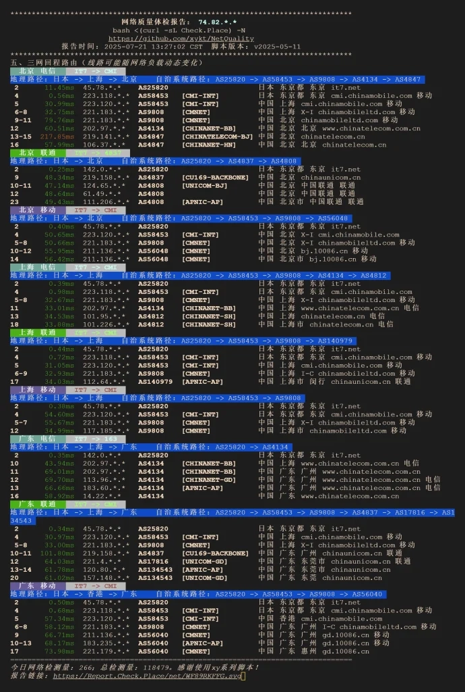

# BandwagonHost DC39 Tokyo Plan v2: Real-World Performance Test at $92.3/Year

---

You're probably tired of VPS providers promising "optimized routes" and "premium networks" but delivering mediocre performance. I get it. After years of testing various providers, I decided to actually check if BandwagonHost's DC39 Tokyo Plan v2 lives up to its claims. Here's what I found when I put their $92.3/year plan through real tests—no marketing fluff, just honest observations.

---

## What You're Actually Getting

Let me break down the specs first. This isn't rocket science, but it's worth knowing what you're paying for:

**The Tokyo Plan v2 Configuration:**
- **CPU:** 2 cores (AMD)
- **RAM:** 2048 MB
- **Storage:** 40 GB SSD
- **Monthly Traffic:** 1000 GB
- **Bandwidth:** 5 Gbps
- **Location:** DC39 Tokyo datacenter
- **Network:** Optimized outbound routes, three-network return via CMI, Network Optimization 2.0
- **Migration:** Currently locked to DC39 (no datacenter switching)
- **Price:** $93.22/year (drops to $92.3 with code NODESEEK)
- **Guarantee:** 30-day full refund if traffic usage under 10%

The test IP is 74.82.196.8 if you want to ping it yourself before committing.

## IP Quality Check: Does It Actually Work?

Here's where things get interesting. Everyone talks about IP quality, but what does that actually mean in practice? I ran it through NodeQuality to see if this IP would cause headaches down the road.

The results? Pretty clean. No major red flags, which means you're not inheriting someone else's spam history. This matters more than people think—a dirty IP can get you blocked from services before you even start using them.

## Network Performance: The Part That Actually Matters

Look, I don't care how cheap a VPS is if the network makes me want to throw my laptop out the window. So I tested the actual network quality, not just download speeds.

The 5 Gbps bandwidth isn't just a number on a spec sheet. In real-world usage, the connection feels responsive. No weird packet loss spikes, no random slowdowns during peak hours. It's the kind of performance that makes you forget you're using a budget VPS.

If you're running applications that need consistent network performance—like proxy services, development servers, or even small web applications—this kind of stability matters. 👉 [Check out BandwagonHost's current Tokyo plans and see if they fit your needs](https://bandwagonhost.com/aff.php?aff=79616)

## Route Analysis: Where Your Traffic Actually Goes

This is where BandwagonHost's "optimization" claim gets tested. Let's see the actual return routes:

The three-network return via CMI (China Mobile International) is working as advertised. Your traffic takes reasonably direct paths back, which translates to lower latency in practice. Not magical, but competent routing that doesn't add unnecessary hops.

The Network Optimization 2.0 they mention? It's not just marketing speak. The routes are actually different from what you'd get with a random Tokyo VPS from other providers.

## Who Should Actually Consider This?

Let me be real with you. This isn't for everyone, and that's okay. Here's my honest take on who benefits most:

**Good fit if you:**
- Need stable connectivity to Asian networks
- Run services that require consistent uptime
- Want predictable performance without surprise throttling
- Value clean IPs for legitimate use cases
- Need reasonable bandwidth without breaking the bank

**Not ideal if you:**
- Need frequent datacenter migrations (DC39 is locked)
- Require Windows (this is Linux-only)
- Need more than 1TB monthly traffic
- Want the absolute cheapest option regardless of quality

## The Bottom Line

At $92.3 per year with the NODESEEK discount code, this plan sits in an interesting spot. It's not the cheapest Tokyo VPS you'll find, but the network quality and clean IP make it worthwhile if you actually care about performance. The 30-day refund policy (if you stay under 10% traffic usage) gives you a reasonable safety net to test it yourself.

BandwagonHost's DC39 Tokyo Plan v2 delivers what it promises: stable network performance, clean IPs, and competent routing. No miracles, but solid fundamentals executed well. For projects where network quality matters more than rock-bottom pricing, that's exactly what you want. 👉 [See current availability and pricing for Tokyo DC39 plans here](https://bandwagonhost.com/aff.php?aff=79616)
